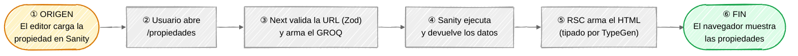
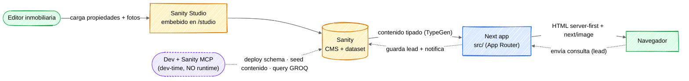
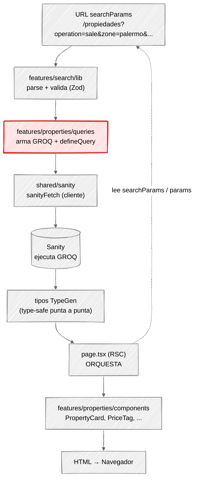
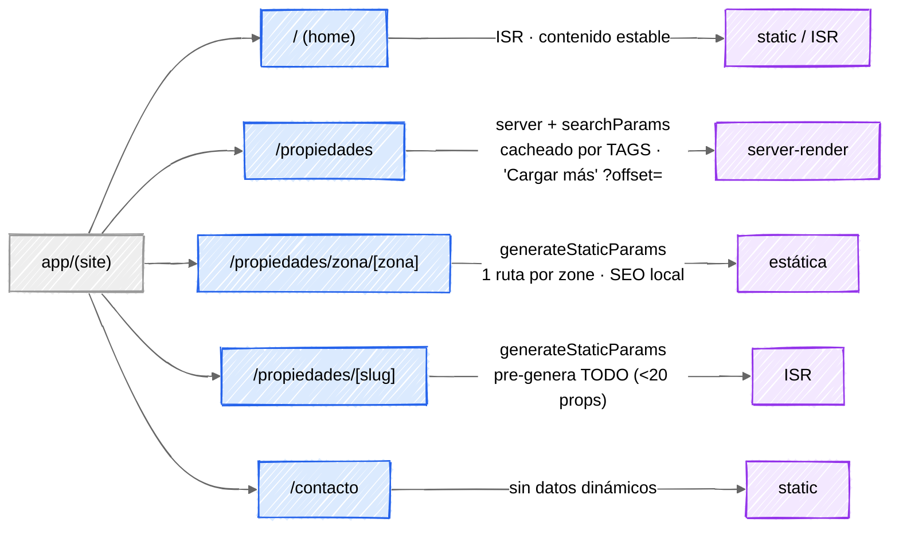
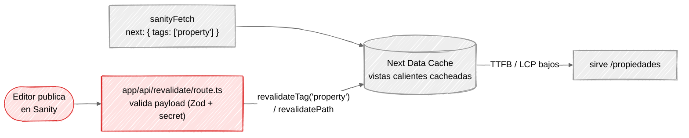
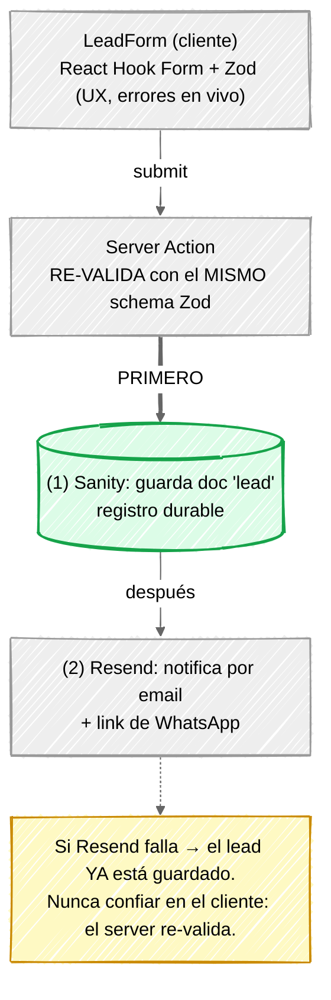

# GRAPHIC — Mapa visual de la arquitectura

> **Vista derivada.** Este archivo es un *mapa* para entender el sistema de un vistazo. La **fuente
> de verdad** son los specs: si algo cambia, se cambia allá, no acá.
> Estructura y data flow → [`ARCHITECTURE.md`](ARCHITECTURE.md) · Filtros y GROQ →
> [`FILTERS.md`](FILTERS.md) · Schemas → [`SANITY-SCHEMA.md`](SANITY-SCHEMA.md) · Stack →
> [`STACK.md`](STACK.md).
>
> ↑ **Volver:** [`PRD.md`](PRD.md) (producto · entrada) · [`CLAUDE.md`](CLAUDE.md) (índice).
>
> Diagramas en **Mermaid** con `look: handDrawn` (trazo a mano). Renderizan en GitHub, en el preview
> de Markdown del IDE y en Obsidian. Requiere Mermaid ≥ 10.9 para el trazo a mano; en visores viejos
> cae al trazo normal sin perder contenido.

---

## TL;DR — El viaje del dato (ida)

Antes de los detalles: **dónde nace el dato y dónde muere.** Ojo con la intuición — el dato **no
nace cuando el usuario entra a la web**: ya existía en Sanity desde que el editor cargó la propiedad.
El usuario solo dispara el *viaje* de ese dato hacia su pantalla.

- 🟡 **Origen** = Sanity (el contenido ya existía ahí antes de la visita).
- 🟢 **Fin** = el navegador del usuario.
- Hay un **segundo viaje, de vuelta**: una consulta nace en el navegador y muere guardada como `lead`
  en Sanity (ver capa 5). Esta línea es el de **ida**, el principal.

Las 5 capas siguientes hacen zoom en cada tramo.

---

## 1. Big picture — Sanity ⇄ Next ⇒ Navegador

Tres dominios. Sanity es la **fuente de contenido**; Next **renderiza server-first** y manda HTML al
navegador; el navegador solo devuelve una cosa al server: la **consulta de un lead**.

> 🟣 **Sanity MCP** (línea punteada): herramienta de **dev-time / autoría**, no del runtime.
> La usamos para **deployar el schema**, sembrar contenido de ejemplo y correr queries GROQ mientras
> desarrollamos. **No** sirve props al navegador — eso lo hace `shared/sanity` (`sanityFetch`) en las
> capas siguientes. El *source* del schema sigue siendo el código (`defineType`); el MCP lo opera, no
> lo reemplaza. Detalle en [`STACK.md §2`](STACK.md).

---

## 2. El camino de las props — `/propiedades`

El flujo es **unidireccional y server-first**. La **URL es la única fuente de verdad** del estado de
búsqueda ([`ARCHITECTURE §3`](ARCHITECTURE.md), [`FILTERS §3,§4`](FILTERS.md)).

**Quién hace qué (la pregunta clave):**
- **`page.tsx` orquesta** — lee `searchParams`, llama queries, compone componentes. Nada de lógica.
- **`features/search/lib` arma los params** — parsea la URL y la valida con **Zod** (descarta basura).
- **`features/properties/queries` hace la llamada de las props** — arma el GROQ tipado con
  `defineQuery` y lo dispara vía `sanityFetch`.
- **`shared/sanity` es el cliente** — `sanityFetch` con tags de cache (ver capa 4).

> 🔴 `features/properties/queries` (en rojo) = **el archivo que hace la llamada de las props.**
> El `page.tsx` no fetchea: orquesta. Los componentes son *presentational* (reciben props, no fetchean).

---

## 3. Render por ruta

Cada ruta elige su estrategia según SEO + frescura ([`ARCHITECTURE §4`](ARCHITECTURE.md)).

---

## 4. Cache + revalidación

El listado **no es full-dynamic**: se cachea por **tags** y se invalida **por contenido, no por
TTL** ([`ARCHITECTURE §4`](ARCHITECTURE.md)).

> Publicar una propiedad ⇒ webhook ⇒ `revalidateTag('property')` ⇒ solo esas vistas se regeneran.
> **No se espera ningún TTL.** El detalle (`[slug]`) se revalida por ruta con el mismo webhook.

---

## 5. Leads — el orden importa

El formulario captura una consulta. **Primero persiste el `lead` en Sanity, después notifica por
Resend.** Si Resend falla, el lead igual quedó guardado — un lead = posible venta, no puede depender
de un email ([`ARCHITECTURE §3`](ARCHITECTURE.md)).

---

## Leyenda

| Color | Significa |
|-------|-----------|
| 🟡 Amarillo | Sanity / CMS (contenido) |
| 🔵 Azul | App Next / rutas |
| 🟣 Violeta | Estrategia de render |
| 🔴 Rojo | Punto crítico (la llamada de props · la invalidación de cache) |
| 🟢 Verde | Cliente / paso que persiste primero |
